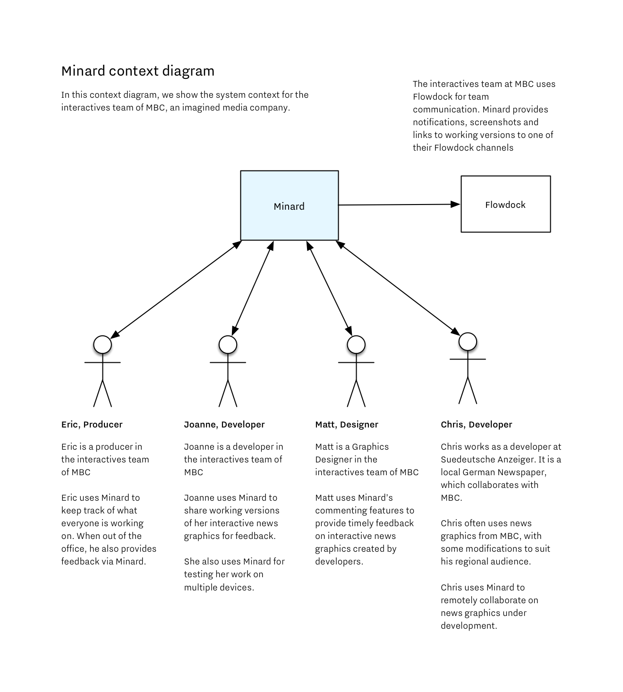
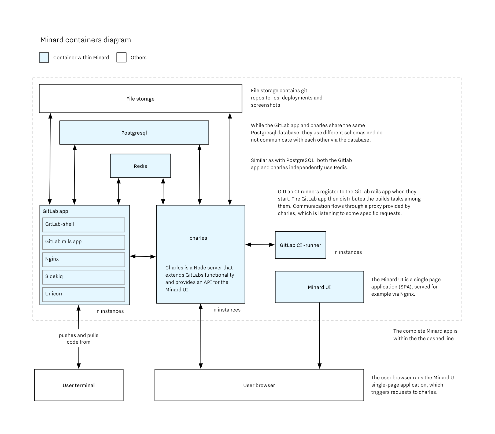
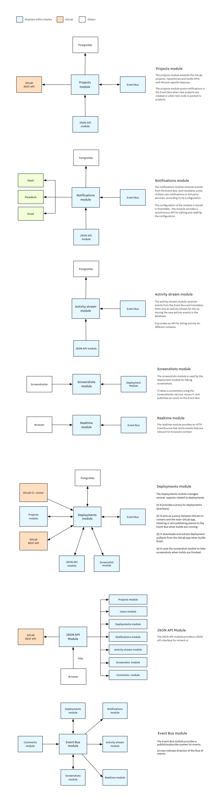

# Architecture

We use the [C4 model](http://static.codingthearchitecture.com/c4.pdf) for
representing Minard's system architecture with system context, containers,
and diagrams.

## System context

The system context diagram below shows the big picture in which Minard operates.

## Containers

The container diagram below shows the high-level shape of the software architecture, how
responsibilities are distributed across it, and how different pieces communicate with
each other.

## Modules

The main service of Minard's backend is `charles`.  Charles is written
in TypeScript 2 and runs a [Hapi.js](http://hapijs.com)-based Node server.

Charles has been divided into modules, which
correspond to "components" in the C4 model.

Below are module diagrams for the main modules within charles.

